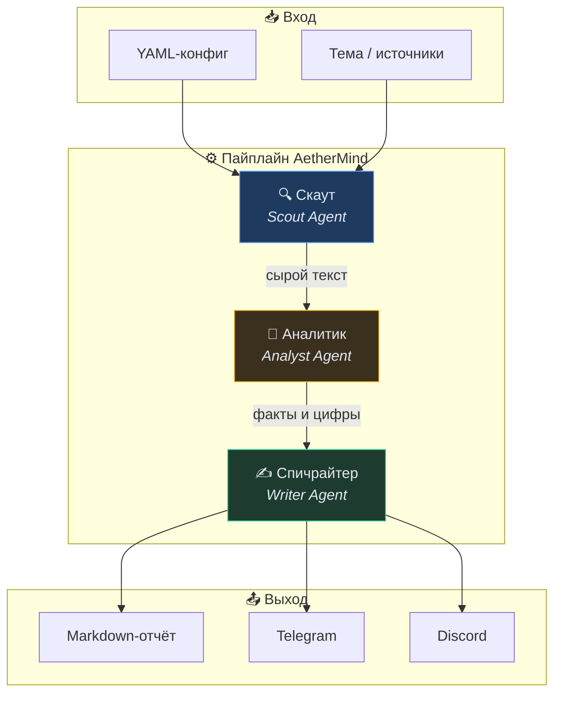

<div align="center">

# ✦ AetherMind

**Твоя личная автономная редакция.**

Сложная, динамичная сфера — крипта, ИИ-тренды, игровой рынок — превращается в готовый аналитический отчёт без ручного копания в лентах.

<br/>

[](https://www.python.org/)
[](LICENSE)
[](https://platform.openai.com/)

<br/>

[Быстрый старт](#-быстрый-старт) ·
[Агенты](#-три-агента) ·
[Конфигурация](#%EF%B8%8F-конфигурация) ·
[Доставка](#-доставка-отчётов) ·
[Структура](#-структура-проекта)

</div>

---

## 💡 Зачем это нужно

Информационный шум растёт быстрее, чем ты успеваешь его читать. **AetherMind** берёт на себя всю грязную работу:

1. **Собирает** свежие материалы из RSS, Reddit и веб-страниц
2. **Фильтрует** кликбейт, рекламу и спекуляции
3. **Пишет** структурированный отчёт в твоём стиле

На выходе — Markdown-файл, готовый пост для Telegram или сообщение в Discord.

---

## 🤖 Три агента



| Агент | Кодовое имя | Задача |
|:------|:------------|:-------|
| 🔍 **Скаут** | `ScoutAgent` | Парсит RSS, Reddit и сайты. Умеет сам подбирать доверенные источники по теме |
| 🧠 **Аналитик** | `AnalystAgent` | Жёсткий фильтр: отсеивает мусор, оставляет факты, цифры и инсайды с оценкой уверенности |
| ✍️ **Спичрайтер** | `WriterAgent` | Упаковывает выжимку в красивый Markdown под твой фирменный стиль |

---

## 🚀 Быстрый старт

### Требования

- Python **3.11+**
- API-ключ любого **OpenAI-compatible** провайдера (OpenAI, Groq, локальный прокси и т.д)

### Установка

```bash
git clone https://github.com/Honored-Karma/AetherMIND.git
cd AetherMIND

python -m venv .venv

# Windows
.venv\Scripts\activate

# macOS / Linux
source .venv/bin/activate

pip install -e .
```

### Настройка окружения

```bash
copy .env.example .env      # Windows
# cp .env.example .env      # macOS / Linux
```

Открой `.env` и укажи ключ:

```env
OPENAI_API_KEY=sk-...
OPENAI_BASE_URL=https://api.openai.com/v1
OPENAI_MODEL=gpt-4o-mini
```

### Первый запуск

```bash
aethermind run configs/crypto.yaml
```

Готовый отчёт появится в папке `output/`.

<details>
<summary><b>Пример вывода в терминале</b></summary>

```
╭────────────────────────────── AetherMind ──────────────────────────────╮
│ Скаут собирает данные…                                                 │
╰────────────────────────────────────────────────────────────────────────╯
  → 15 материалов
╭────────────────────────────── AetherMind ──────────────────────────────╮
│ Аналитик фильтрует факты…                                              │
╰────────────────────────────────────────────────────────────────────────╯
  → 8 фактов, отброшено ~7
╭────────────────────────────── AetherMind ──────────────────────────────╮
│ Спичрайтер оформляет отчёт…                                            │
╰────────────────────────────────────────────────────────────────────────╯
  → сохранено: output/20260702_143022_Криптовалюты_и_DeFi.md

Готово! Отчёт: output/20260702_143022_Криптовалюты_и_DeFi.md
```

</details>

---

## ⚙️ Конфигурация

Каждый запуск управляется YAML-файлом. Готовые примеры лежат в `configs/`.

### Минимальный конфиг

```yaml
topic: "Криптовалюты и DeFi"
auto_discover: true
max_articles: 15
output_dir: output
```

При `auto_discover: true` Скаут сам подберёт источники, если тема совпадает с одной из встроенных категорий.

### Поддерживаемые темы (auto-discover)

| Ключевые слова в `topic` | Источники |
|:-------------------------|:----------|
| `крипт`, `crypto`, `defi`, `bitcoin`, `блокчейн` | CoinTelegraph, CoinDesk, r/CryptoCurrency |
| `ии`, `ai`, `gpt`, `llm`, `нейросет` | MIT Tech Review, VentureBeat AI, r/MachineLearning |
| `игр`, `gaming`, `esport` | Polygon, GamesIndustry, r/Games |

### Свои источники

```yaml
topic: "Моя ниша"
auto_discover: false

sources:
  - type: rss
    url: https://cointelegraph.com/rss
    label: CoinTelegraph
    max_items: 8

  - type: reddit
    url: https://www.reddit.com/r/CryptoCurrency
    label: r/CryptoCurrency
    max_items: 10

  - type: web
    url: https://example.com/news
    label: Example News
    max_items: 1
```

| Тип | Описание |
|:----|:---------|
| `rss` | RSS / Atom лента |
| `reddit` | Публичный сабреддит (JSON API) |
| `web` | Произвольная веб-страница |

### Стиль Спичрайтера

```yaml
writer_style: >
  Лаконичный аналитический стиль для Telegram-канала:
  факты, цифры, без кликбейта. Короткие абзацы.
```

---

## 📬 Доставка отчётов

По умолчанию отчёт сохраняется только в `output/`. Чтобы отправить его автоматически:

**1.** Добавь переменные в `.env`:

```env
TELEGRAM_BOT_TOKEN=123456:ABC...
TELEGRAM_CHAT_ID=-1001234567890

DISCORD_WEBHOOK_URL=https://discord.com/api/webhooks/...
```

**2.** Включи доставку в конфиге:

```yaml
deliver_telegram: true
deliver_discord: true
```

---

## 📁 Структура проекта

```
AetherMIND/
├── aethermind/
│   ├── agents/
│   │   ├── scout.py        # 🔍 Скаут — сбор данных
│   │   ├── analyst.py      # 🧠 Аналитик — фильтрация фактов
│   │   └── writer.py       # ✍️ Спичрайтер — оформление отчёта
│   ├── sources/
│   │   └── fetchers.py     # RSS, Reddit, Web парсеры
│   ├── outputs/
│   │   └── delivery.py     # Сохранение и отправка
│   ├── cli.py              # Точка входа CLI
│   ├── pipeline.py         # Оркестратор пайплайна
│   ├── models.py           # Pydantic-модели
│   ├── config.py           # Настройки и загрузка YAML
│   └── llm.py              # OpenAI-compatible клиент
├── configs/
│   ├── crypto.yaml         # Пример: крипта
│   └── ai.yaml             # Пример: ИИ
├── output/                 # Сгенерированные отчёты (gitignore)
├── .env.example
├── pyproject.toml
└── README.md
```

---

## 🔧 Переменные окружения

| Переменная | Обязательна | Описание |
|:-----------|:-----------:|:---------|
| `OPENAI_API_KEY` | ✅ | API-ключ LLM-провайдера |
| `OPENAI_BASE_URL` | — | Базовый URL API (по умолчанию OpenAI) |
| `OPENAI_MODEL` | — | Модель (по умолчанию `gpt-4o-mini`) |
| `TELEGRAM_BOT_TOKEN` | — | Токен бота для доставки |
| `TELEGRAM_CHAT_ID` | — | ID чата / канала |
| `DISCORD_WEBHOOK_URL` | — | Webhook URL сервера Discord |

---

## 🛣 Roadmap

- [ ] Планировщик запусков (cron / Task Scheduler)
- [ ] Веб-дашборд для просмотра отчётов
- [ ] Больше встроенных тем и источников
- [ ] Поддержка X (Twitter) и Hacker News
- [ ] Telegram-бот с интерактивными командами

---

## 📄 Лицензия

MIT — используй свободно, форкай, улучшай.

---

<div align="center">

**AetherMind** — когда нужен не поток новостей, а готовая редакция.

<br/>

⭐ Поставь звезду, если проект пригодился

</div>
